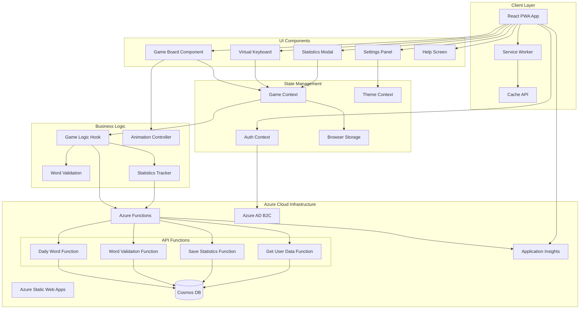
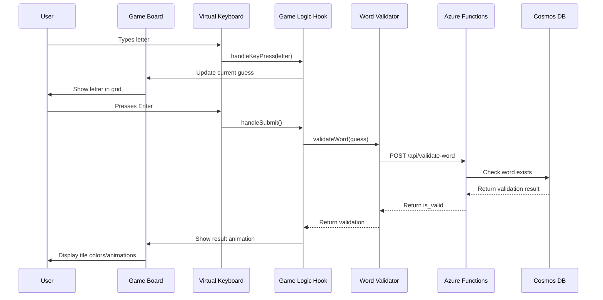
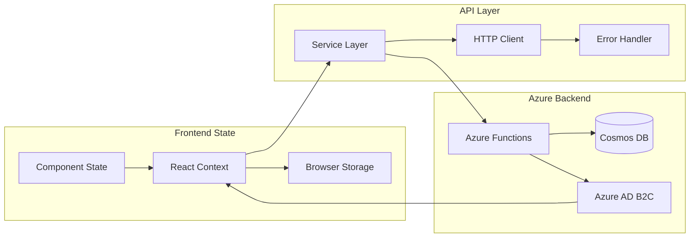
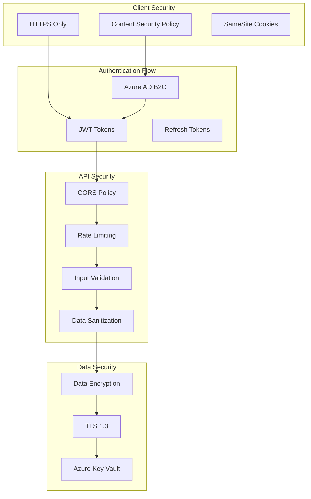
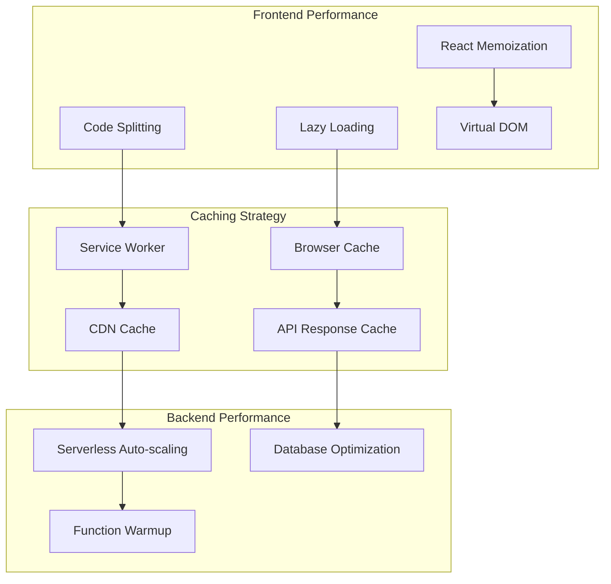
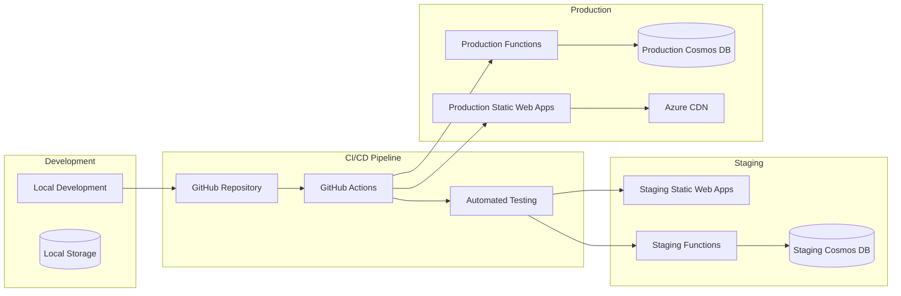
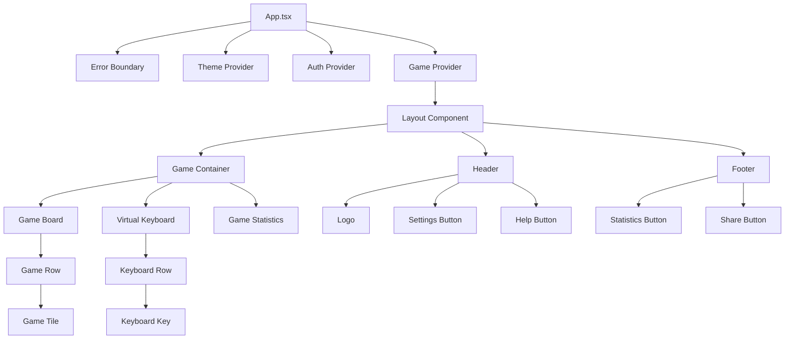

# Azure F&B Wordle - Detailed Architecture Documentation

## System Overview

## Component Interaction Flow

## Data Flow Architecture

## Security Architecture

## Performance Architecture

## Deployment Architecture

## Component Hierarchy

## Technology Stack Details

### Frontend Technologies
- **React 18.3+**: Concurrent features, automatic batching, Suspense
- **TypeScript 5+**: Strict type checking, advanced types
- **Vite 5+**: Fast build tool, HMR, tree shaking
- **SCSS**: Modular styling with CSS custom properties
- **Framer Motion**: Complex animations and gestures
- **Material Design 3**: Expressive design system

### Backend Technologies
- **Azure Functions**: Serverless compute (Node.js 20+ runtime)
- **Azure Cosmos DB**: NoSQL database with global distribution
- **Azure Static Web Apps**: Integrated hosting and API
- **Azure AD B2C**: Identity and access management
- **Application Insights**: Monitoring and analytics

### Development Tools
- **ESLint + Prettier**: Code quality and formatting
- **Vitest**: Fast unit testing framework
- **React Testing Library**: Component testing utilities
- **Playwright**: End-to-end testing
- **GitHub Actions**: CI/CD automation

### Performance Optimizations
- **Code Splitting**: Route-based and component-based
- **Tree Shaking**: Remove unused code
- **Service Worker**: Offline support and caching
- **Image Optimization**: WebP format with fallbacks
- **Bundle Analysis**: Size monitoring and optimization

### Security Features
- **Content Security Policy**: XSS protection
- **HTTPS Everywhere**: Secure communication
- **Input Validation**: Server and client-side validation
- **Rate Limiting**: API abuse prevention
- **CORS Configuration**: Cross-origin request control

## Monitoring and Analytics

### Application Insights Integration
- **Real User Monitoring**: Page load times, user interactions
- **Custom Events**: Game completion, word guesses, error tracking
- **Performance Counters**: API response times, function execution
- **Dependency Tracking**: Database queries, external API calls

### Key Metrics
- **Performance**: Page load time, time to interactive, first contentful paint
- **User Engagement**: Games played, completion rate, return visits
- **Error Tracking**: JavaScript errors, API failures, network issues
- **Business Metrics**: Daily active users, word completion rate, share rate

### Alerting
- **Performance Alerts**: Response time > 3s, error rate > 5%
- **Availability Alerts**: Service downtime, function failures
- **Usage Alerts**: Unusual traffic patterns, quota exceeded
- **Security Alerts**: Failed authentication attempts, suspicious activity
